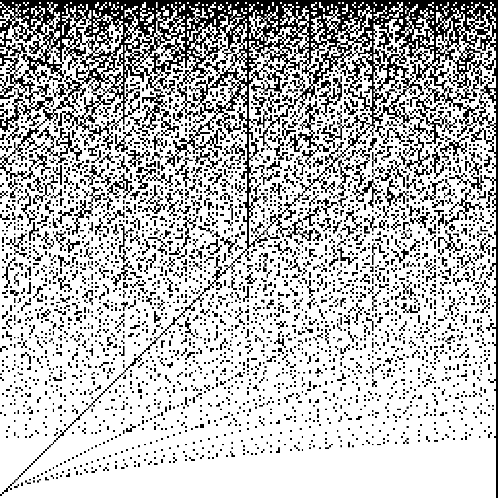

The support of the multiplication table can be arranged into an n by n square-grid display.

Black pixels mark integers k that occur as products

    k = a*b

with

    1 <= a,b <= n.

White pixels mark integers not attained in the n by n multiplication table.

These visualizations are informally called cloud chambers in this project.

## n = 256

## Interactive visualizations

- [Memory stride visualization](widgets/stride.html)

[Back to home](./)
